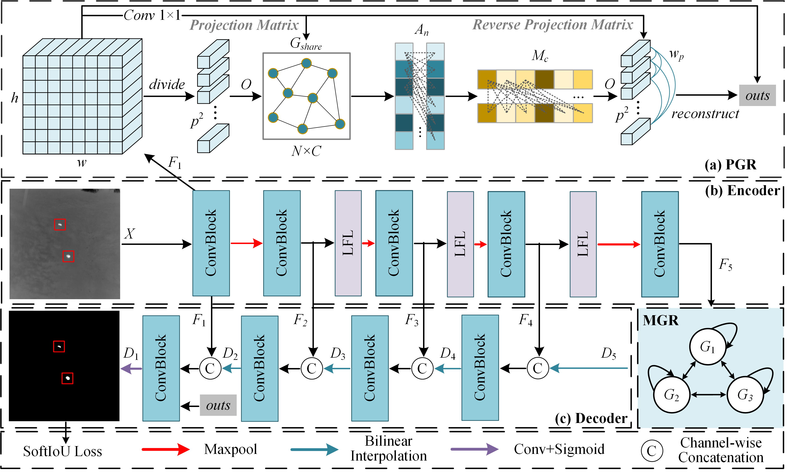

# GCLNet
This is the official implementation code for “[Graph-based context learning network for infrared small target detection](https://www.sciencedirect.com/science/article/abs/pii/S092523122401720X)”. More detailed information is provided below.
<div align="center">
  
  Overview of the proposed GCLNet for infrared small object detection.
  
  3D ROC curves along with three corresponding 2D ROC curves of different methods on the NUAA-SIRST and NUDT-SIRST datasets.
</div>


## Requirements
* Python 3.7
* pytorch 1.11.0

## Datasets
* NUAA-SIRST [[download]](https://github.com/YimianDai/sirst)
* NUDT-SIRST [[download]](https://github.com/YeRen123455/Infrared-Small-Target-Detection)

## Experiments
The training and testing experiments are conducted using PyTorch with a single GeForce RTX 3080 GPU.

### Pretrained models
Google Drive: [[download]](https://drive.google.com/drive/folders/1121Lw6sCxflmFHe1mobThdHR-8N4vJoe?usp=sharing)

### Training
```python  
python train.py  
```

### Testing
```python  
python test.py  
```

## Acknowledgements
This project is based on the following open-source projects. We thank their authors for making the source code publically available.
  * [BasicIRSTD](https://github.com/XinyiYing/BasicIRSTD)
